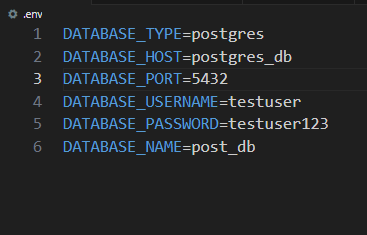
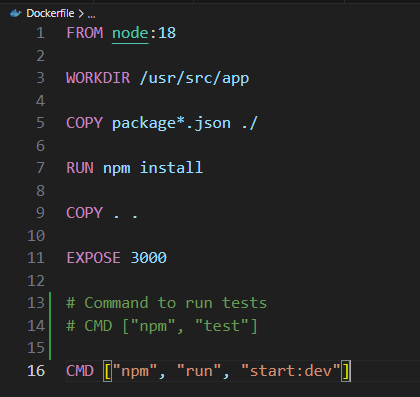
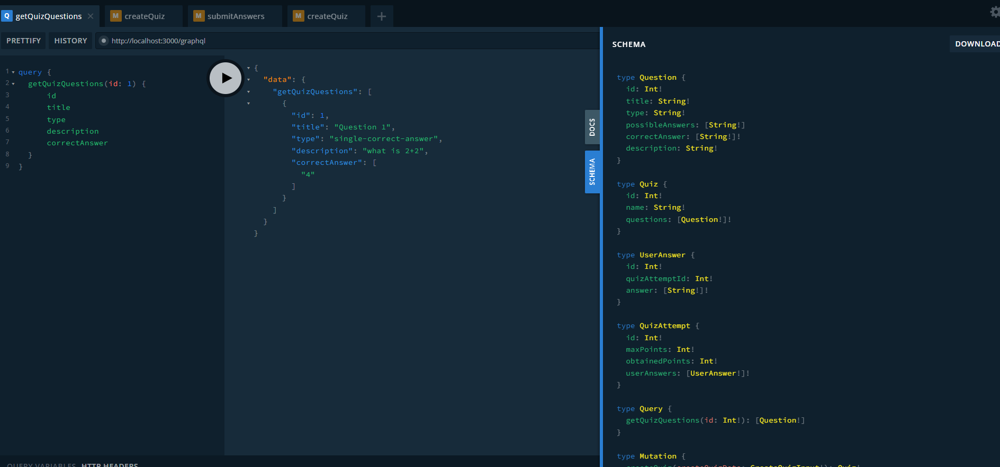
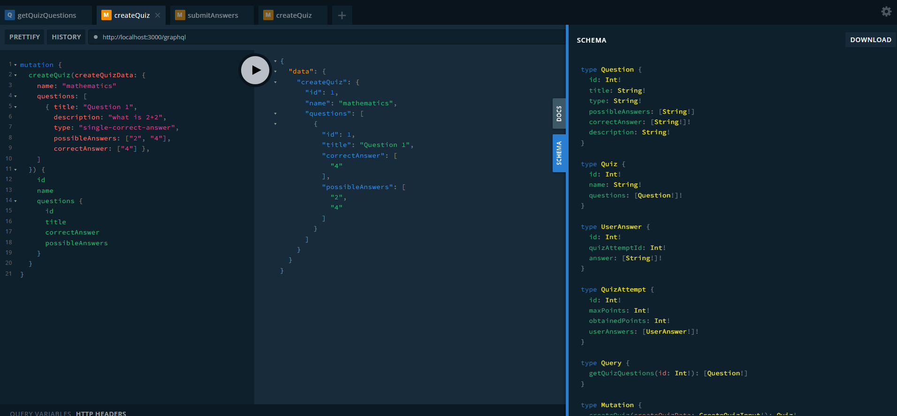
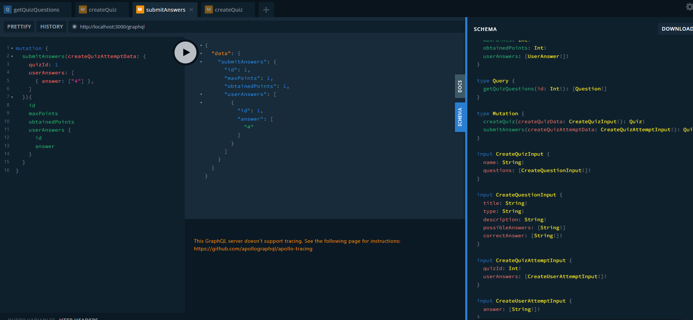

# Quiz Project - NestJS Backend

This NestJS application serves as the backend for a quiz platform designed for both teachers and students. The primary functionalities include:

- Creating quizzes
- Fetching quizzes
- Submitting quiz answers

## Purpose

The application is intended to facilitate the creation, management, and completion of quizzes within an educational context. Teachers can create quizzes, and students can access and submit their answers. Additionally, the platform supports fetching quizzes for review or combining them for comprehensive assessments.

## Project Structure

- **src:** Source code for the NestJS application.
- **.env:** Environment variables configuration.
- **.gitignore:** Configuration to ignore certain files in version control.
- **package.json:** Project dependencies.
- **README.md:** Project documentation.
- **tsconfig.json:** TypeScript configuration.

### Prerequisites

- Node.js and npm installed
- PostgreSQL database (can be run with Docker Compose)

### Installation and Run

1.  Clone the repository:

    ```bash
    git clone https://github.com/Banjo7331/BackendForAQuizApplication_in_NestJS.git
    ```

    or

    ```bash
    git clone git@github.com:Banjo7331/BackendForAQuizApplication_in_NestJS.git
    ```

2.  Navigate to the project directory:

    ```bash
    cd BackendForAQuizApplication_in_NestJS
    ```

3.  Install dependencies:

    ```bash
    npm install

    npm install --save-dev jest
    ```

4.  Run the application locally
    If so you need to change host for localhost in .env file:
    
    DATABASE_HOST should be equal **localhost**:

        ```bash
        npm run start:dev
        ```

5.  Run the application with Docker
    Need to have Docker deamon running. If using docker desktop and wsl start application and configure it with wsl to work:
    ```bash
    docker-compose up --build
    ```
    If want to wark with diffrent named database need to do this command after changing name in .env file for db:
    ```bash
    docker-compose down -v
    ```
    It ensures that database was created.

### Tests

1. Run tests locally:
   ```bash
     npm test
   ```
2. Run tests with docker. Should change in Dockerfile CMD ["npm", "run", "start:dev"] for CMD ["npm", "test"]:
   

### GraphQL Playground

Open the GraphQL Playground:

```bash
http://localhost:3000/graphql
```

As everything worked fine we should se this on this route:
| Query for gettingQuizesById |Mutation for creatingQuiz | Mutation for submittingQuiz |
|---|---|---|
|  |  |  |

We have there 3 API Calls for creating Quiz, getting quiz Questions and sumbiting answers to the Quiz choose by its id
There are examples from screenshot to test:

- **createQuiz(Mutation)**
  ```
  mutation {
    createQuiz(createQuizData: {
      name: "mathematics"
      questions: [
        { title: "Question 1",
          description: "what is 2+2",
          type: "single-correct-answer",
          possibleAnswers: ["2", "4"],
          correctAnswer: ["4"] },
      ]
    }) {
      id
      name
      questions {
        id
        title
        correctAnswer
        possibleAnswers
      }
    }
  }
  ```
- **getQuizQuestions(Query)**
  ```
  query {
    getQuizQuestions(id: 1) {
        id
        title
        type
        description
        correctAnswer
    }
  }
  ```
- **submitAnswers(Mutation)**
  ```
  mutation {
    submitAnswers(createQuizAttemptData: {
      quizId: 1
      userAnswers: [
        { answer: ["4"] },
      ]
    }){
      id
      maxPoints
      obtainedPoints
      userAnswers {
        id
        answer
      }
    }
  }
  ```
### There can be only 4 types of question:
- #### 'multiple-correct-answer',
- #### 'single-correct-answer',
- #### 'plain-text-answer',
- #### 'sorting-answers',
If diffrent from theme will be typed there will be exception in the form of an error message about it
### You can make diffrent Quizes and Answers for theme as long as they meet the requirements, otherwise an error will be thrown with information about what was entered incorrectly, e.g. **"incorrect name"** or **"inappropriate id"** and **"inappropriate amount of data in the tables"** etc..
